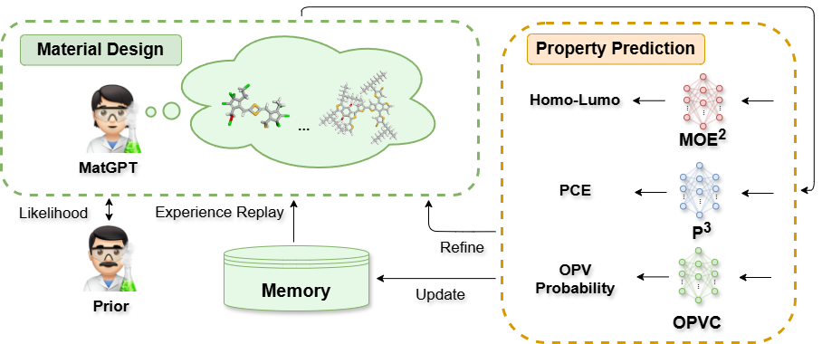

# CycleChemist

Implementation of [**CycleChemist: A Dual-Pronged Machine Learning Framework for Organic Photovoltaic Discovery**](https://arxiv.org/abs/2511.19500).

## Overview

Our dual-pronged OPV discovery framework combines material generation, property prediction, and reinforcement learning for iterative improvement:



## Datasets

- **Experimental dataset (used in experiments)**: `CycleChemist/data/exp_dataset.csv`
- **Active / continuously updated dataset**:  [OPV2D](https://github.com/sunyrain/OPV2D)

## Quick Start

### Installation

This repo was developed with Python 3.9. A minimal setup is:

```bash
conda create -n CycleChemist python=3.9 -y
conda activate CycleChemist

# PyTorch (example: CUDA 11.8; adjust for your machine)
pip install torch==2.7.1 torchvision==0.22.1 torchaudio==2.7.1 --index-url https://download.pytorch.org/whl/cu118

# Core scientific stack
conda install -c conda-forge numpy pandas tqdm psutil scikit-learn rdkit torch-geometric tensorboard matplotlib seaborn -y
```

### Data Preparation

#### PubChem

```bash
cd data/
wget ftp://ftp.ncbi.nlm.nih.gov/pubchem/Compound/Extras/CID-SMILES.gz
gunzip CID-SMILES.gz
tr '\t' ',' < CID-SMILES > CID-SMILES.csv
sed -i '1i CID,SMILES' CID-SMILES.csv
python down_sample.py
cd ..
```

#### MMC2

Source: "Design Principles and Top Non-Fullerene Acceptor Candidates for Organic Photovoltaics" (https://www.sciencedirect.com/science/article/pii/S2542435117301307)

```bash
cd data/
wget -O mmc2.csv "https://ars.els-cdn.com/content/image/1-s2.0-S2542435117301307-mmc2.csv"
cd ..
```

### Training

#### MatGPT Pretraining

```bash
python matgpt/code/pretrain.py --config matgpt/pretrain_config/pubchem.json
tensorboard --logdir matgpt/runs/matgpt_pretrain_pubchem/
```

#### Training OPVC

```bash
python property_predictors/opvc/build_opv_dataset.py
python property_predictors/opvc/train_rf_classifier.py
```

#### Training MOE2 and P3

```bash
python property_predictors/moe2_p3/pretrain.py
python property_predictors/moe2_p3/train_pce.py

tensorboard --logdir property_predictors/moe2_p3/runs/MLM-Pretrain
tensorboard --logdir property_predictors/moe2_p3/runs/HOMO-Finetune
tensorboard --logdir property_predictors/moe2_p3/runs/HOMO-EXP-Finetune
tensorboard --logdir property_predictors/moe2_p3/runs/PCE-Predict
```

#### MatGPT Finetuning (on `exp_dataset.csv`)

```bash
# Fit to data/exp_dataset.csv
python matgpt/code/pretrain.py --config matgpt/pretrain_config/exp_dataset.json
tensorboard --logdir matgpt/runs/matgpt_pretrain_exp_dataset/
```

**Case study: fix acceptor (Y6) and search for donors**

```bash
python matgpt/code/finetune.py \
  --run_name donor_Y6 \
  --prior_path matgpt/ckpt/matgpt_pretrain_exp_dataset/final_model.pt \
  --target_type "donor" \
  --fixed_smiles "CCCCCCCCCCCc1c(/C=C2\C(=O)c3cc(F)c(F)cc3C2=C(C#N)C#N)sc2c1sc1c3c4nsnc4c4c5sc6c(CCCCCCCCCCC)c(/C=C7\C(=O)c8cc(F)c(F)cc8C7=C(C#N)C#N)sc6c5n(CC(CC)CCCC)c4c3n(CC(CC)CCCC)c21"

tensorboard --logdir matgpt/runs/donor_Y6
```

**Case study: fix donor (PTB7-Th) and search for acceptors**

```bash
python matgpt/code/finetune.py \
  --run_name acceptor_PTB7-Th \
  --prior_path matgpt/ckpt/matgpt_pretrain_exp_dataset/final_model.pt \
  --target_type "acceptor" \
  --fixed_smiles "CCCCC(CC)COC(=O)c1sc2c(-c3cc4c(-c5ccc(CC(CC)CCCC)s5)c5sc(C)cc5c(-c5ccc(CC(CC)CCCC)s5)c4s3)sc(C)c2c1F"

tensorboard --logdir matgpt/runs/acceptor_PTB7-Th
```

#### Optional: Sampling

```bash
python matgpt/code/sample.py \
  --model_path matgpt/ckpt/rl_fine_tune/donor_Y6/step500.pt \
  --vocab_path data/vocab_pubchem_len20-290_no_ions_no_multi_random5M_123.txt \
  --output_path results/out.csv
```

## Citation

If you use this work in your research, please cite the following papers:
```bibtex
@misc{qiu2025,
      title={Accelerating High-Efficiency Organic Photovoltaic Discovery via Pretrained Graph Neural Networks and Generative Reinforcement Learning}, 
      author={Jiangjie Qiu and Hou Hei Lam and Xiuyuan Hu and Wentao Li and Siwei Fu and Fankun Zeng and Hao Zhang and Xiaonan Wang},
      year={2025},
      eprint={2503.23766},
      archivePrefix={arXiv},
      primaryClass={cs.LG},
      url={https://arxiv.org/abs/2503.23766}, 
}

@misc{lam2025cyclechemistdualprongedmachinelearning,
      title={CycleChemist: A Dual-Pronged Machine Learning Framework for Organic Photovoltaic Discovery}, 
      author={Hou Hei Lam and Jiangjie Qiu and Xiuyuan Hu and Wentao Li and Fankun Zeng and Siwei Fu and Hao Zhang and Xiaonan Wang},
      year={2025},
      eprint={2511.19500},
      archivePrefix={arXiv},
      primaryClass={cond-mat.mtrl-sci},
      url={https://arxiv.org/abs/2511.19500}, 
}
```
And cite the original data sources:

```bibtex
@article{Min2020,
   author  = {Wu, Yao and Guo, Jie and Sun, Rui and Min, Jie},
   title   = {Machine learning for accelerating the discovery of high-performance donor/acceptor pairs in non-fullerene organic solar cells},
   journal = {npj Computational Materials},
   volume  = {6},
   number  = {1},
   pages   = {120},
   year    = {2020}
}

@article{Saeki2021,
   author  = {Miyake, Yuta and Saeki, Akinori},
   title   = {Machine Learning-Assisted Development of Organic Solar Cell Materials: Issues, Analyses, and Outlooks},
   journal = {The Journal of Physical Chemistry Letters},
   volume  = {12},
   number  = {51},
   pages   = {12391-12401},
   year    = {2021}
}

@article{lopez2017design,
   title     = {Design principles and top non-fullerene acceptor candidates for organic photovoltaics},
   author    = {Lopez, Steven A and Sanchez-Lengeling, Benjamin and de Goes Soares, Julio and Aspuru-Guzik, Al{\'a}n},
   journal   = {Joule},
   volume    = {1},
   number    = {4},
   pages     = {857--870},
   year      = {2017},
   publisher = {Elsevier}
}
```